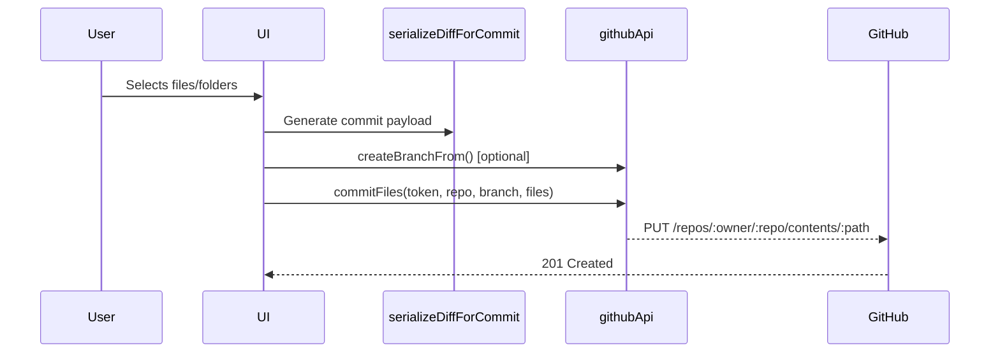

# 🧭 GitHub GUI — Developer Handover Documentation

**Version:** 0.0.0  
**Hosting:** GitHub Pages + Vercel  
**Auth:** GitHub OAuth App  
**Frontend:** React + Material UI + Vite  
**Build Tool:** Vite 7  
**Deployment:** gh-pages script or Vercel auto-build  
**Purpose:** A visual GitHub repository management tool for comparing branches or ZIPs, inspecting diffs, and committing selective changes.

---

## 1. Overview
GitHub GUI is a **client-side React application** that replaces internal PowerShell scripts for managing GitHub repositories.  
It allows developers to visually compare a repository branch with another branch or with an uploaded ZIP file, view differences, select specific files or folders, and commit only the desired changes.

It is designed for **lightweight deployments** (GitHub Pages / Vercel) with **OAuth authentication** and no backend server.

---

## 2. Architecture Overview

### 2.1 Folder Structure
```
src/
 ├── api/                 # GitHub REST API wrapper
 ├── components/          # UI components (bars, panels, dialogs, layout)
 │    ├── auth/           # OAuth login panel
 │    ├── layout/         # TopBar, Sidebar, TabsBar, StatusBar
 │    └── panels/         # Diff panels and selectors (BranchDiff, ZipDiff, etc.)
 ├── hooks/               # Custom React hooks (e.g. useGitHubOAuth)
 ├── utils/               # Helper libraries (diffs, ZIP, serialization, tree building)
 ├── theme/               # Material UI theme customization
 ├── App.jsx              # Root component — layout orchestration and routing
 └── main.jsx             # Entry point — renders <App /> inside React root
```

### 2.2 Technology Stack
| Layer | Library | Purpose |
|-------|----------|----------|
| **UI Framework** | React 19 + Material UI 7 | Component rendering and layout |
| **Styling** | Emotion + MUI Theme | Customizable dark/light design |
| **Animation** | Framer Motion | Smooth transitions and micro-animations |
| **Diff Engine** | diff-match-patch | Efficient text diffing |
| **ZIP Parser** | JSZip | Read uploaded ZIP archives |
| **Virtualized Lists** | react-virtuoso / react-window | Fast rendering for large file lists |
| **Icons** | @mui/icons-material + lucide-react | Unified icon system |
| **Notifications** | react-hot-toast | Lightweight toast messages |
| **Auth** | GitHub OAuth (via `useGitHubOAuth`) | Secure user authentication |
| **Build** | Vite | Lightning-fast bundling and HMR |
| **Linting** | ESLint 9 + react-hooks plugin | Enforces React best practices |

---

## 3. Data Flow & Core Workflows

### 3.1 OAuth Flow
```mermaid
graph LR
A[User clicks "Login with GitHub"] --> B[GitHub OAuth App]
B --> C[Authorization Code]
C --> D[Exchange for Access Token]
D --> E[Token stored in React state (memory only)]
E --> F[Used for all API requests]
```
No persistent storage is used. Tokens are invalidated on page reload.

---

### 3.2 Branch vs ZIP Compare
1. User selects **target branch**.  
2. User uploads a **ZIP**.  
3. `zipUtils.js` unpacks contents → returns array `{ path, text }`.  
4. `diffUtils.js` compares branch file contents vs ZIP text using `diff-match-patch`.  
5. `buildTreeFromDiffs.js` generates nested structure.  
6. `FileTreeView.jsx` displays tri-state checkboxes (select all / partial / none).  
7. Selected diffs are passed to `serializeDiffForCommit.js`.  
8. Commit executed via `githubApi.commitFiles()`.

---

### 3.3 Branch vs Branch Compare
1. User selects **source** and **target** branches.  
2. `githubApi` retrieves changed files via GitHub’s REST endpoints.  
3. `BranchDiffPanel.jsx` renders side-by-side diffs.  
4. User selects items and pushes commit as above.

---

### 3.4 Commit Flow


---

## 4. Module Breakdown with Key Examples

### 4.1 `src/api/githubApi.js`
Central GitHub REST interface.

**Provides:**
```js
listRepos(token, visibility)
listBranches(token, fullName)
createBranchFrom(token, repo, newBranch, baseBranch)
commitFiles(token, repo, branch, files)
```

**Example:**
```js
const githubApi = {
  async listBranches(token, repoFullName) {
    const res = await fetch(`https://api.github.com/repos/${repoFullName}/branches`, {
      headers: { Authorization: `Bearer ${token}` },
    });
    return res.json();
  }
};
```

---

### 4.2 Panels

#### `BranchSelectorBar.jsx`
- Two dropdowns for *source* and *target* branch.  
- Fetches branches using `githubApi.listBranches`.  
- Controlled via `setBranchSource()` / `setBranchTarget()`.

#### `ZipSelectorBar.jsx`
- Handles ZIP upload using a hidden `<input type="file">`.  
- Displays filename and “Upload/Replace ZIP” button.  
- Optional target branch selection dropdown.

#### `DiffPanelBase.jsx`
- Shared UI container for both diff types.  
- Provides compare/export buttons, file tree view, and commit bar integration.

#### `CommitBar.jsx`
- Text input for commit message.  
- Executes `githubApi.commitFiles()` with selected diffs.  
- Displays toast notifications on success/error.

#### `NewBranchBar.jsx`
- Form for creating a new branch based on existing branch.  
- Uses `githubApi.createBranchFrom()`.

---

### 4.3 Layout Components
- `TopBar.jsx` – Dark/light toggle, user info.  
- `Sidebar.jsx` – Navigation tabs (Branch Diff / ZIP Diff / New Branch).  
- `StatusBar.jsx` – Shows selected repo, branches, and busy state.  
- `TabsBar.jsx` – Handles main tab navigation.

---

### 4.4 Utility Modules

| File | Function |
|------|-----------|
| `utils/diffUtils.js` | Wraps `diff-match-patch` to compute line diffs and classify files (added/modified/deleted). |
| `utils/zipUtils.js` | Extracts ZIPs using JSZip; skips binaries; returns `{ path, text }[]`. |
| `utils/fileTreeUtils.js` | Builds tree structure and manages tri-state selection logic. |
| `utils/buildTreeFromDiffs.js` | Converts diff lists to folder/file hierarchies. |
| `utils/serializeDiffForCommit.js` | Converts diff array into `{ path, content }` payloads ready for the GitHub API. |

---

### 4.5 `hooks/useGitHubOAuth.js`
Handles OAuth flow and token management.  
```js
const { auth, login, logout } = useGitHubOAuth();
```
Exposes token and basic user info. Token is stored only in memory.

---

### 4.6 `theme/muiTheme.js`
Defines custom MUI theme:
- GitHub-style colors (`#161b22`, `#f6f8fa`)  
- Border colors adjusted for dark mode  
- Shared typography and font families  
- Used via `<ThemeProvider theme={muiTheme}>`

---

## 5. Build & Development

### 5.1 Scripts (`package.json`)
| Script | Description |
|---------|-------------|
| `npm run dev` | Start Vite dev server |
| `npm run build` | Production build (outputs `/dist`) |
| `npm run preview` | Serve built app locally |
| `npm run lint` | Lint source files using ESLint |
| `npm run deploy` | Deploy `/dist` folder to GitHub Pages using `gh-pages` package |

### 5.2 Dev Environment
Requirements:
- Node.js ≥ 18  
- npm ≥ 9  

**Local Run:**
```bash
npm install
npm run dev
```
Runs at `http://localhost:5173`.

**Build & Deploy (Pages):**
```bash
npm run build
npm run deploy
```

**Vercel:**
- Set environment variables `VITE_GITHUB_CLIENT_ID` and `VITE_REDIRECT_URL`.  
- Build command: `npm run build`  
- Output directory: `dist`

---

## 6. Testing & Maintenance

### 6.1 Unit Tests (recommended)
| Module | Test Focus |
|---------|-------------|
| `fileTreeUtils` | Folder recursion, partial selection logic |
| `serializeDiffForCommit` | ZIP vs branch content serialization |
| `githubApi` | Error handling, rate limit responses |
| `diffUtils` | Diff accuracy for large text/XML |
| `useGitHubOAuth` | Token management, logout cleanup |

### 6.2 Manual Tests
- Large ZIP uploads (~100 MB).  
- Switching branches while comparing.  
- Creating branch + committing → verify in GitHub.  
- OAuth login/logout cycle.  
- Dark mode color consistency.  
- Handling 401 / 403 responses.

---

## 7. Security
- OAuth tokens live only in memory (`useState`).  
- Never persisted to localStorage or cookies.  
- Restrict OAuth scopes to:  
  `read:user`, `repo`, `repo:status`.  
- Validate ZIP file paths to avoid traversal.  
- Handle GitHub rate limits gracefully (`Retry-After` header).  
- Always serve over HTTPS.

---

## 8. Extending the Application

### Adding a New Panel
1. Create a component under `src/components/panels/`.  
2. Import and register it in `App.jsx`.  
3. Add navigation entry in `Sidebar.jsx` or `TabsBar.jsx`.

### Adding a New API Call
1. Add function to `src/api/githubApi.js`.  
2. Wrap the REST endpoint with `fetch()` + `Authorization` header.  
3. Return `await res.json()`.  
4. Consume in a new or existing panel.

### Adding New Utility Logic
Helpers should be pure functions under `/utils` and covered by Jest tests if added later.

---

## 9. Deployment Notes
- Build result in `/dist` is **static** — no runtime dependencies.  
- Works both on **Vercel** (auto builds on push) and **GitHub Pages** (manual deploy via script).  
- CORS-safe since all requests go directly to `api.github.com`.  
- Optionally, a proxy can be added for enterprise GitHub instances.

---

## 10. Known Limitations
- No binary diff visualization.  
- No pagination for >100 branches.  
- GitHub API rate-limits may throttle frequent commits.  
- Large XMLs may lag in rendering (consider streaming diff viewer).  
- No offline support (requires network for API).  

---

## 11. Future Enhancements
- Pull Request creation directly from commits.  
- Inline XML diff highlighting.  
- Persistent user preferences (theme, last repo).  
- Enhanced CI/CD automation for deploy.  
- Jest + Playwright test suite.

---

## 12. Summary
GitHub GUI is a **fully client-side GitHub management interface** built with modern React, MUI, and Vite.  
It enables developers to visually manage repositories, inspect differences, and push selective changes without needing CLI or scripts.

This documentation covers:
- Setup and build workflow.  
- Component and module responsibilities.  
- Data flow and authentication.  
- Extension patterns and security guidelines.

Any developer can use this to **rebuild, deploy, or extend** the app confidently.
